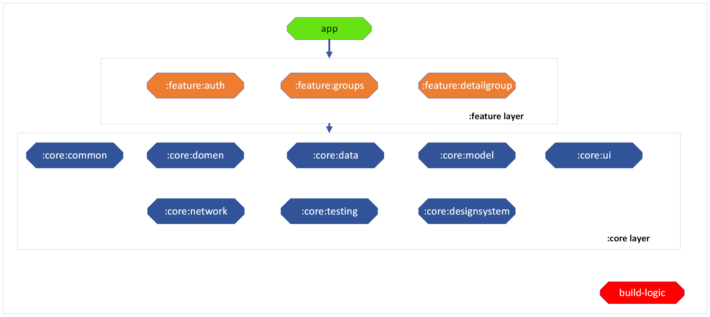

# Мобильное приложение 

## Архитектура компонета `verba-app`

[Модуль app](/app/README.md)  
[Проект build-logic](/build-logic/README.md)  
[Модули core](/core/README.md)  
[Модули feature](/feature/README.md)

## Библиотеки
Основной стек:
- Kotlin
- Jetpack Compose
- Ktor 
- Hilt 

Остальные библиотеки и их версии в [Конфигурационном файле](/gradle/libs.versions.toml)
