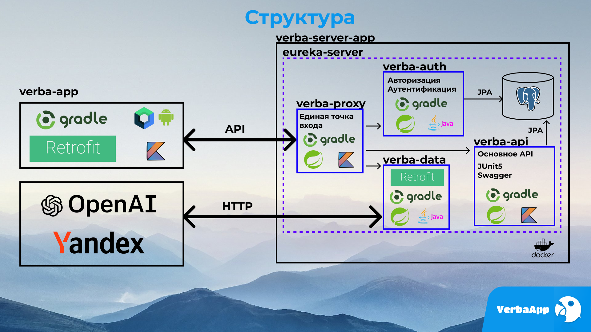

# Verba

  

## Описание
Verba - это клиент-серверное приложение для визуального изучения иностранных языков.
## Идея
Изучение языка через образы - это метод обучения, который использует визуальные образы, такие как картинки и фотографии, для помощи в изучении языка. Этот метод основывается на идее, что увидев конкретный предмет или действие визуально, мы можем лучше запомнить связанные с ними слова и фразы.  
Изучение языка через образы может быть очень полезным, особенно для визуально ориентированных людей. Такой подход может помочь улучшить понимание языка и повысить мотивацию к изучению, что может привести к более быстрому и эффективному освоению новых языковых навыков.  
Приложение Verba в изучении языка через образы поможет с легкостью подбирать картинки и другие материалы из разных источников, чтобы пользователь изучающий иностранный язык меньше тратил время на поиск информации  

## Архитектура проекта

## Презентация проекта

[Скачать презентацию](image/slide.pdf)

## Архитектура компонета `verba-app`

[Модуль app](/app/README.md)  
[Проект build-logic](/build-logic/README.md)
[Модули core](/core/README.md)  
[Модули feature](/feature/README.md)

## UseCases

[Ссылка на Miro](https://miro.com/app/board/uXjVMeAQjCg=/?share_link_id=479259400433)

## Образы

<video width="320" height="240" controls>
  <source src="image/video.mp4" type="video/mp4">
</video>

